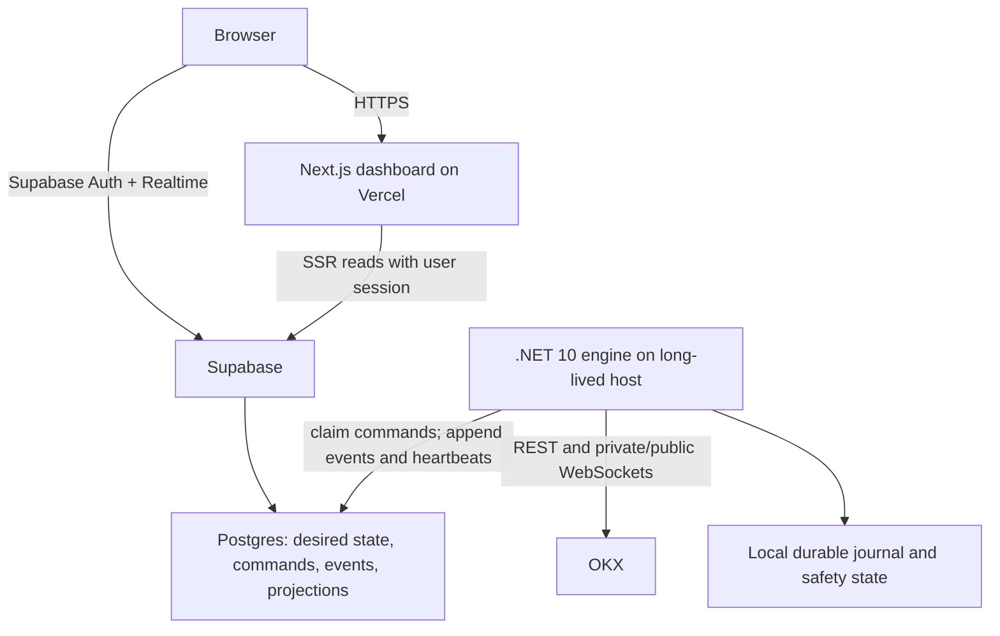

# MGBIP-001: Web-operated micro-grid topology on Vercel and Supabase

## Decision

Build a browser-operated system with three independently deployable parts:

1. a Next.js dashboard on Vercel;
2. Supabase for authentication, the command/event store, and Realtime UI updates; and
3. the existing .NET 10 trading engine as a long-lived container on an operator-controlled host.

Vercel Functions and Supabase Edge Functions MUST NOT run the trading loop. The engine owns the OKX WebSocket sessions, exchange credentials, order reconciliation, and local safety controls.

This proposal targets zero infrastructure spend during paper/demo use. It does **not** promise a production trading service with an SLA at $0/month. Free-tier availability, terms, quotas, and reclaim/pause rules are external constraints and MUST be revalidated before live trading.

## Goals and non-goals

### Goals

- Operate and observe the bot from a browser without a home PC on the order path.
- Preserve the .NET domain and `IExchangeGateway` boundary.
- Make every control command authenticated, authorized, auditable, idempotent, and acknowledged.
- Recover safely after process, network, database, or exchange interruptions.
- Support paper mode first, OKX demo second, and live trading only after explicit readiness gates.
- Keep a documented path from free tiers to paid, supported infrastructure without redesigning the application.

### Non-goals

- Running a continuous trading engine inside serverless or edge functions.
- Promising instant remote control while the engine, Supabase, or the network is unavailable.
- Multi-exchange operation in v1.
- Custody, withdrawals, leverage, futures, or autonomous strategy changes.
- Treating the dashboard or Supabase mirror as the source of truth for exchange state.

## Constraints

- The engine remains .NET 10 and container-first (`linux-x64` and `linux-arm64`).
- OKX credentials exist only on the engine host and are trade-only, withdrawal-disabled, and IP-allowlisted where OKX permits it.
- The browser receives only a Supabase publishable key. Secret/service-role keys MUST remain server-side and MUST NOT use a `NEXT_PUBLIC_` variable.
- UTC is used for storage, logs, commands, and reconciliation.
- Live trading requires a host and data tier whose terms permit the intended use. Vercel Hobby is restricted to personal, non-commercial use; whether this bot qualifies MUST be resolved before deployment.

## Architecture



The browser does not call a private engine endpoint. It inserts a command through a narrowly scoped database function or server-side action. The engine pulls and atomically claims pending commands, validates current state, executes the action, and writes an acknowledgement. Realtime reflects state changes to the UI; it is an optimization, not a correctness dependency.

### Component responsibilities

| Component | Responsibilities | Must not do |
|---|---|---|
| Next.js App Router | Sign-in, dashboard, accessible controls, SSR initial view, command submission | Hold exchange keys; infer command success from button clicks |
| Supabase Auth | Operator identity and session lifecycle | Store authorization in user-editable metadata |
| Supabase Postgres | Command queue, audit log, read models, config versions, heartbeats | Replace exchange reconciliation or local safety state |
| Supabase Realtime | Notify the dashboard of changed projections | Be required for command execution or recovery |
| .NET engine | Strategy loop, exchange sessions, risk enforcement, command execution, reconciliation | Trust browser-supplied risk parameters without validation |
| Engine host | Restart policy, encrypted secrets, outbound connectivity, host monitoring | Expose an unauthenticated public control API |

## State and control model

### Sources of truth

- **Exchange:** balances, fills, and currently open exchange orders.
- **Engine journal:** last reconciled cursor, intended order transitions, risk state, and recovery checkpoints.
- **Supabase:** operator intent, immutable audit events, heartbeats, and UI projections.

On startup or reconnect, the engine MUST reconcile exchange balances/open orders before placing or cancelling anything. Database state alone MUST NOT authorize new orders.

### Minimum schema

All identifiers are UUIDs and all timestamps are `timestamptz`.

| Table | Purpose | Important fields |
|---|---|---|
| `operators` | Maps an auth user to an application role | `user_id`, `role`, `disabled_at` |
| `bot_instances` | One row per engine deployment | `id`, `mode`, `status`, `last_heartbeat_at`, `version` |
| `bot_commands` | Durable operator intent | `id`, `bot_id`, `type`, `payload`, `requested_by`, `idempotency_key`, `status`, `expires_at`, `claimed_at`, `completed_at`, `error_code` |
| `bot_events` | Append-only audit/event stream | `id`, `bot_id`, `sequence`, `type`, `occurred_at`, `correlation_id`, `data` |
| `grid_snapshots` | Current UI projection | `bot_id`, `version`, `mid_price`, `exposure`, `pnl`, `updated_at` |
| `orders` | Sanitized order projection | exchange IDs, side, price, quantity, state, timestamps |
| `fills` | Immutable sanitized fills | exchange trade ID, order ID, price, quantity, fee, timestamp |
| `config_versions` | Versioned non-secret strategy configuration | `bot_id`, `version`, `config`, `created_by`, `activated_at` |

Unique constraints MUST cover `(bot_id, idempotency_key)`, event `(bot_id, sequence)`, exchange order IDs, and exchange trade IDs. Retention and aggregation jobs MUST prevent unbounded event/fill growth on a 500 MB tier.

### Command lifecycle

`pending -> claimed -> succeeded | rejected | failed | expired`

- Creation happens through a constrained `request_bot_command(...)` database function or a Vercel Server Action that uses the caller's session.
- The database derives `requested_by` from `auth.uid()`; it is never accepted from the client.
- The engine atomically claims one command with a lease. A crashed worker permits safe retry after lease expiry.
- Commands carry an idempotency key, expiry, expected bot/config version, and correlation ID.
- `pause`, `resume`, `recenter`, and `rescale` are validated against an explicit state machine.
- Command success means an engine acknowledgement was persisted. UI delivery or HTTP 200 alone does not mean success.
- Destructive/high-risk commands require a confirmation phrase and recent authentication. A future multi-user mode SHOULD require two-person approval for enabling live mode.

### Kill switches

There are two distinct controls:

1. **Local fail-safe:** the engine stops placing orders and attempts to cancel open orders when risk limits, reconciliation, credentials, or required connectivity fail. This is the authoritative safety mechanism.
2. **Remote emergency stop:** an operator command with highest priority. It is best-effort and cannot work while the command path or engine is unavailable.

The UI MUST display heartbeat age and command acknowledgement state prominently, and MUST never label an unacknowledged request as "stopped".

## Supabase security baseline

- Use a dedicated application schema or explicitly grant Data API access only to required objects. New tables are not assumed to be exposed automatically.
- Enable RLS on every object exposed through the Data API. Default deny, then add per-operation policies.
- Authorization roles live in `app_metadata` or `operators`, never `user_metadata`.
- Dashboard reads require `auth.uid()` membership in the target bot. Command creation additionally requires an `operator` or `owner` role.
- Clients cannot update command status, events, heartbeats, orders, fills, or projections.
- Views exposed to clients use `security_invoker = true` on supported Postgres versions.
- Avoid `SECURITY DEFINER`. If it is necessary for atomic command claiming, place it in a non-exposed schema, set a safe `search_path`, revoke default `PUBLIC` execute, grant only to the engine role, and validate the caller inside the function.
- The engine uses a dedicated least-privilege database credential or narrowly scoped backend identity. The Supabase service-role key is not the default engine credential.
- Sensitive payloads, secrets, raw exchange messages, and credentials MUST NOT be written to Realtime tables or browser-visible logs.
- Migrations, grants, RLS policies, and policy tests live in source control. CI runs schema linting plus positive and negative authorization tests.

## Next.js and Vercel design

- Use the App Router with Server Components for initial reads and small Client Components for Realtime and interactive controls.
- Use the current Supabase SSR package and cookie-based sessions. Protect server reads by validated claims/user identity, not by trusting a client session object.
- Default to the Node.js runtime. There is no requirement for Edge runtime in v1.
- Every page has loading, empty, stale, offline, unauthorized, and error states.
- Realtime subscriptions are filtered by bot ID; reconnect triggers a fresh snapshot fetch to close event gaps.
- Mutations enforce origin/CSRF protection, rate limits, schema validation, idempotency, and an audit correlation ID.
- Security headers include a restrictive CSP, HSTS, frame denial, nosniff, and a conservative referrer policy.
- Vercel preview deployments use a non-production Supabase branch/project and can never reach live OKX credentials.
- Pin Node.js 22+ and package versions; commit the lockfile. Pin the Vercel CLI version if custom CI is introduced.

## Reliability and recovery

- The engine writes a heartbeat at a bounded interval with version, mode, exchange connectivity, reconciliation state, and last processed event/command.
- Staleness thresholds drive UI status: healthy, delayed, stale, and offline.
- Network/database write failures use bounded exponential backoff with jitter and a local outbox. The outbox has a size limit and alerts before disk exhaustion.
- Exchange WebSocket gaps trigger REST reconciliation using exchange IDs and cursors.
- Order placement uses deterministic client order IDs so retries do not duplicate orders.
- A single active engine lease prevents two workers controlling the same bot. Lease loss forces a safe pause.
- Database migrations are backward compatible across one deployment window: expand, deploy readers/writers, then contract.
- Before production promotion, restore tests MUST prove that backups and the local engine journal can recover the required state.

### Degraded modes

| Failure | Required behaviour |
|---|---|
| Dashboard/Vercel unavailable | Engine continues; local risk controls remain active |
| Realtime unavailable | UI polls snapshots; engine is unaffected |
| Supabase unavailable | Engine enters configured safe mode; queues bounded telemetry locally; no remote commands |
| OKX private stream gap | Stop new placement, reconcile via REST, then resume only if consistent |
| Engine restart | Acquire lease, reconcile exchange, replay journal/outbox, then become ready |
| Engine heartbeat stale | UI shows offline and disables commands except recording an emergency-stop intent |

The exact safe mode during a Supabase outage (continue existing grid versus cancel-and-pause) MUST be selected and tested before OKX demo deployment. Live mode SHOULD default to cancel-and-pause until evidence supports a different policy.

## Hosting and cost reality

| Layer | Paper/demo candidate | Production requirement |
|---|---|---|
| Dashboard | Vercel Hobby if use is permitted | A plan whose terms permit the intended financial/commercial use |
| Data/auth | Supabase Free within quotas | Paid tier or equivalent with backups, support, and an availability objective |
| Engine | Oracle Cloud Always Free A1 if capacity/account eligibility permits | A supported always-on VM with stable egress IP, monitoring, backups, and tested recovery |

Fly.io is not a general $0 backup for new accounts; its free allowances are legacy. Oracle free capacity is not guaranteed and instances may be reclaimed. Supabase Free can pause low-activity projects and has no included automatic backups. Therefore:

- never generate artificial traffic merely to evade provider inactivity policies;
- export encrypted logical backups to a separate location on a tested schedule;
- alert at 70%, 85%, and 95% of storage/egress quotas;
- document a paid-host migration and a maximum acceptable monthly budget before live mode;
- treat a custom domain as optional; Vercel supports custom domains on Hobby, subject to plan terms and limits.

## Observability

- Structured logs include `bot_id`, `correlation_id`, command ID, order ID, exchange request ID, mode, and software version; secrets and auth tokens are redacted.
- Metrics cover heartbeat age, WS reconnects, reconciliation duration/failures, open orders, exposure, command latency/failures, local outbox depth, rate-limit responses, and database/storage usage.
- Alerts cover stale engine, repeated reconciliation failure, max exposure, rejected/cancelled order anomalies, database outage, disk pressure, expiring credentials, and backup/restore failure.
- The first alert channel may be Discord, but alerts MUST include a second path for engine-offline and credential-expiry events.
- The operations runbook includes pause/cancel verification, credential rotation, database restore, engine replacement, provider outage, and rollback.

## Delivery plan and gates

### Phase 0 - paper engine

- Complete the paper `IExchangeGateway` orchestration: place, fill, re-arm, rescale, exposure block, and drop protection.
- Add deterministic restart/replay and duplicate-event tests.

**Gate:** all domain and orchestration tests pass; simulated 10% drop and process restart preserve risk invariants.

### Phase 1 - Supabase contract

- Add versioned migrations, seed data, generated TypeScript/C# types, RLS, command functions, retention, and policy tests.
- Implement the engine command consumer, lease, journal, outbox, heartbeat, and projections.

**Gate:** cross-user access is denied; duplicate commands/fills are harmless; migration and restore tests pass; security and performance advisors are clean or documented.

### Phase 2 - dashboard

- Add auth, overview, grid/order/fill views, stale-state UX, command confirmations, audit history, accessibility, and responsive layouts.
- Add unit tests, component tests, and Playwright flows for sign-in, stale status, command acknowledgement, rejection, and timeout.

**Gate:** preview deployments use isolated non-live data; no secret reaches client bundles; authorization and CSP tests pass.

### Phase 3 - OKX demo and host

- Implement the OKX.Net adapter, quantization, rate limits, partial fills, reconnect/reconcile, and deterministic client order IDs.
- Build multi-architecture images, run as non-root, configure restart/health checks, encrypted secrets, stable outbound IP, and monitoring.

**Gate:** at least seven continuous days in demo mode, forced network/database/restart tests pass, remote commands are audited and acknowledged, and manual exchange-side cancellation is documented.

### Phase 4 - live readiness (separate decision)

- Resolve provider terms, paid fallback budget, backup retention, incident ownership, and the Supabase-outage safe mode.
- Perform a threat model and an operational go/no-go review.
- Start with a separately capped balance below the strategy's eventual target.

**Gate:** live mode remains impossible until an explicit configuration flag, an operator approval, and all readiness checks are recorded. This proposal does not itself authorize live trading.

## Proposed repository changes

```text
src/
  MicroGrid.Web/                       Next.js application
  MicroGrid.Infrastructure.Postgres/   command/event/projection adapter
  MicroGrid.Infrastructure.Realtime/   optional notification adapter
infra/
  supabase/                             config, migrations, seeds, policy tests
  vercel/                               environment matrix and deployment notes
  bot-host/                             host bootstrap and service definitions
docs/
  operations/runbook.md
  security/threat-model.md
```

`MicroGrid.Domain` remains pure. `MicroGrid.Application` may gain state/control ports only when driven by tested orchestration requirements; it MUST NOT depend on Supabase, Next.js, or OKX types.

## Acceptance criteria

- A fresh environment can be built from source-controlled migrations and configuration.
- One authenticated operator can view only authorized bot data and submit only allowed commands.
- An unauthorized or different user cannot read data or submit/acknowledge commands.
- Every command has an immutable requester, correlation ID, lifecycle, acknowledgement, and audit event.
- Duplicate delivery cannot duplicate an exchange order or command effect.
- Engine restart, Supabase outage, Realtime gap, and OKX stream gap have tested behaviours.
- The dashboard clearly distinguishes requested, acknowledged, failed, stale, and offline states.
- Exchange secrets never appear in Git, Vercel client variables, Supabase browser-readable objects, logs, or artifacts.
- Paper/demo deployment operates for seven days without manual process intervention or an unexplained reconciliation difference.
- Backup restore and host replacement are exercised from the runbook.

## Open decisions

The following must be resolved before their corresponding phase gate:

1. Is the deployment strictly personal/non-commercial, and do Vercel Hobby terms permit it?
2. Which host is actually available in the operator's Oracle account, and what paid fallback budget is acceptable?
3. During a Supabase outage, should the engine maintain already-open grid orders or cancel-and-pause?
4. What recovery point and recovery time objectives are required for events, fills, and configuration?
5. Is v1 single-operator only? This proposal assumes yes while keeping bot membership in the schema.
6. Which secondary alert channel complements Discord?

## Status

`proposed`. The architecture is sufficiently specified to begin Phase 0 and schema prototyping. Production/live trading remains deferred until every phase gate and open decision applicable to live mode is closed.
